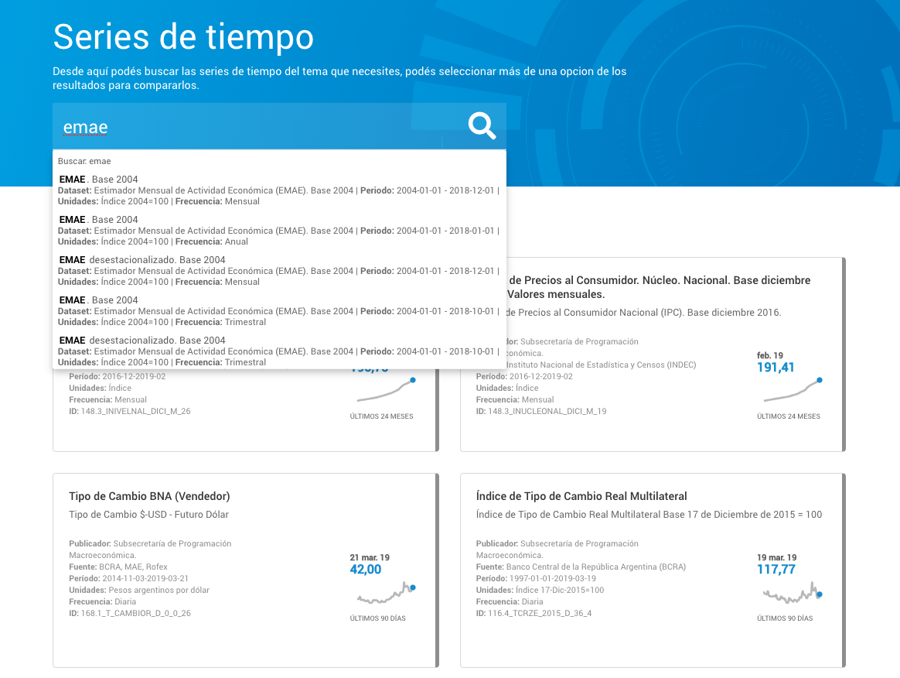
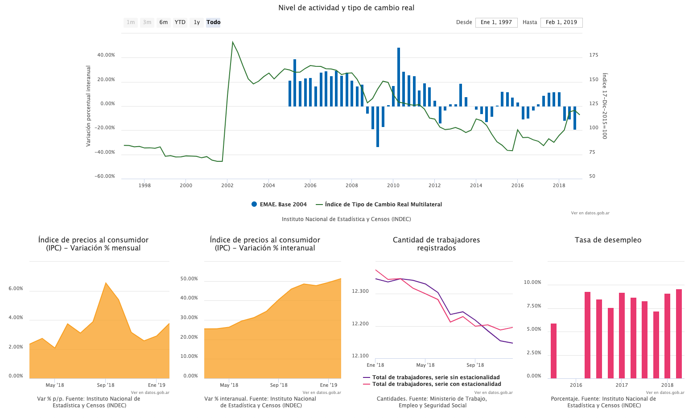

# Explorador de Series de Tiempo

El Explorador de Series de Tiempo es una familia de componentes _front-end_ para desarrollar experiencias web a partir de los datos de la [API de Series de Tiempo de la República Argentina](https://apis.datos.gob.ar/series), donde los organismos de la Administración Pública Nacional publican indicadores en formatos abiertos.

Si querés **integrar un explorador completo en tu sitio web** (como el de [Datos Argentina](https://datos.gob.ar/series)) leé la referencia de **[TSExplorer](reference/ts-explorer.md)**.

Si querés **agregar gráficos en tu sitio web** leé la referencia de **[TSComponents](reference/ts-components.md)**.

## Versiones de browsers

El Explorador de Series de Tiempo fue desarrolado utilizando versiones recientes de Firefox y Chrome (57+ y 60+), y soporta Internet Explorer desde la versión 11 en adelante.

---

*Si sos usuario de la API de Series de Tiempo y querés estar al tanto de los  cambios y novedades, [inscribite en la base de contactos de Datos Argentina](bit.ly/contacto-datos-argentina) y elegí sobre qué temas querés que te escribamos.*

*¿Tenés algo que contarnos? Nos encantaría que nos cuentes por [Twitter](https://twitter.com/datosgobar) o por [mail](mailto:datos@modernizacion.gob.ar) qué mejoró usar la API en tu trabajo y qué le falta para mejorar aún más.*

